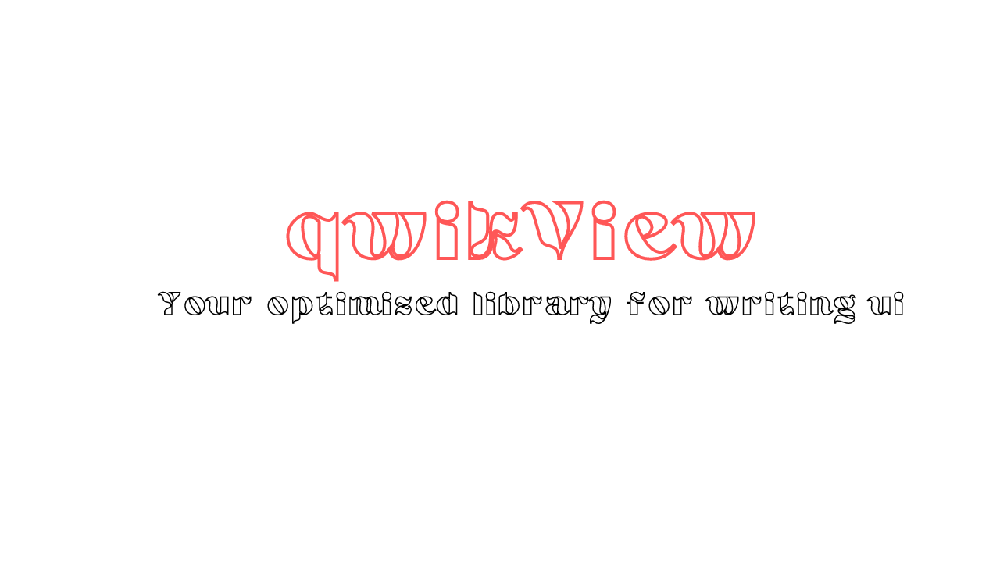

# qwikView : The developer friendly framework

qwikView allows developers to control all ui, using javascript and that makes achieving reactivity easier.

Before libraries were a thing, the way forwad on ui was narrow minded, it was all about separation of concerns and that worked for a while, before we realized we could go crazy with the web.

There are many frameworks and we are just one of them, all built for different niche cases, here is a tip :

> **_NOTE:_** For pages that ussually are demo pages, I dont recommend use of any framework.

Now that we have de-mistified the purpose of all frameworks, here is what makes qwikView different :

- Can be used without a build step
- We build everything and use only a few external libraries
- It is easier to understand and build complex things with
- Codebase scales atleast in a visiually appealing way.

## Getting Started > 3

Firstly link to the file in your html :

```html
<script src="qwikview.core.js"></script>
/** Or */
<script src="qwikview.es.js" type="module"></script>
/** Or */
<script src="https://www.unpkg.com/qwikview" type="module"></script>
/**Or */

npm install qwikview
```

> I will add suport with using vite as a build step 🚀

Now the next focus is your main file, you can call it : `app.js` or `main.js` :

```javascript
/**
 * We use the concept of layouts, these are special divs - you
 * pass in parameters and  those specify the direction and
 * flow of  elements in them.
 */

// For Es Environment
import { html, htmlPage } from "qwikview.es.js";

// let main = html.CreateLayout(type, options);

/**
 * The type is which type of special div you want, ther
 * is the linear div ( content flows in columnar form )
 * and we have absolute ( the polar opposite of linear)
 * lastly we have the frame, which will allow us to
 * place stuff over each other.
 */

let main = html.CreateLayout("linear", "top, vertical, scrolly");

/**
 * For options these specify de=irection and how the main view
 * behaves, we have the following options :
 * center, left, right
 * top, bottom,
 * scrolly, scrollx
 * noscrollbar,
 * fillx, filly, fillxy
 */

// htmlPage.Build(mainContainer, appRoutes)
// Now add the layout to the body.
htmlPage.Build(main);
```

You have a simple qwikView app now, to add elements like buttons and Images, they are all methods in the html Object.

> Refer To The Elements.md Page For more Info

### Basic Elements >3

Here is a display of basic htmlelements in use :

```javascript
let main = html.CreateLayout("linear", "center");

let button = html.Button(main, "Hello World", {
 id: "FirstBtn",
 class: "Button"
});

/**
 * All method function to the html Object has their parameter as
 * the parent :
 * This adds them to that layout, you can use
 * addChild as an alternative
 * (for adding layouts on other layouts)
 *
 * Then have the main param of that element, for an image
 * it will be an array of urls to that image
 *
 * Then finally the props, use gerenal DOM setters in here
 * as an object.
 */

htmlPage.Build(main);
```

## The Approach To Reactivity

Signals have been revived al;l thanks to solid and qwik, so we use them too:

```javascript
import { createSignal } from "./qwikview.es.js";

const onThemeChange = function (val) {
 if (getTheme() == "light") {
  // change all elements to light mode
 } else {
  // change all elements to dark mode
 }
};

let [getTheme, setTheme, onThemeChange] = createSignal("light");

// Access the values via getThene and setTheme
```

## showIF

You can import showIF function which allows you to hide or show certain elements in a page.

That is all, for the framework !
